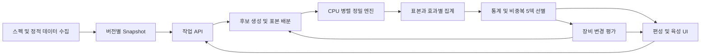

# NIKKE Solo Raid 시뮬레이션·편성·육성 최적화 초안

작성: 2026-09-08. 상태: 설계 제안. P00 개발 기반은 완료했으며 [검증 보고서](p00-verification.ko.md)에 범위를 기록했다. 전체 기능 구현·실전 검증·성능 측정을 완료했다는 의미가 아니다.

구체적인 착수 순서·작업 범위·완료 조건은 [구현 계획](C:/Users/user/Documents/GitHub/Nikke-Simul/docs/implementation-plan.ko.md)을 따른다.

검토 대상은 Moris-kr/nikke-calc와 로컬 Nikke-Dmg-Simulator다. 기존 프로젝트의 코드·FACTS·설정은 변경하지 않았다. P00에서 upstream commit과 선택한 C# 소스 hash를 고정했으며 [출처표](source-map.ko.md)에 기록했다. 제품 데이터 snapshot 계약은 P01에서 정한다.

2026-09-08 사용자 결정 반영:

| 항목 | 상태 | 채택 기준 |
|---|---|---|
| 차지 대미지 | 확정 | 기본 × 배율 + 가산 |
| 히트 정수화 | 비교 필요 | 동일 입력의 후보식과 실게임 히트 관측 대조 |
| 기초 스탯 | 확정 | C# 구현 채택. 사용자 실게임 대조에서 오차 0 |
| 버스트 | 목표 확정 | 실제 팀 게이지 누적과 버스트 사이클 완성 |

이 결정은 이 프로젝트 설계의 기준이다. 아래 기존 구현의 차이는 이식·수정 항목을 설명하기 위한 것이며, 확정된 차지식과 기초 스탯을 미결정 상태로 취급하지 않는다.

## 1. 권장 방향

제품의 출발점은 nikke-calc의 웹 UI, 스펙 입력/연동, 편성·결과 표시다. 정밀 백엔드는 실게임 오차 0으로 검증된 기존 C# 기초 스탯을 채택하고, 차지식은 사용자 확정식으로 수정하며, 히트 정수화는 비교 후 확정한다. 기존 발사 모델과 upstream Python의 팀·스킬 구현을 활용해 실제 팀 게이지·사이클을 완성한다. 공식 계산 엔진은 최종적으로 하나로 통일한다.

우선순위는 단일 덱 정확성 → 표본 저장 → CPU 병렬 Monte Carlo → 비중복 5덱 선별 → 장비 부위별 육성 추천 → Union Raid 확장이다. GPU는 실제 병목과 손익을 측정한 뒤 결정한다.

초기 운영은 개인 PC의 로컬 백엔드와 웹 UI를 가정한다. 여러 사용자를 받는 서비스는 인증·원격 작업 큐·저장소를 확장하는 별도 단계다. 기존 Local Lab의 게임 실행/서버 호환성 작업은 이 제품의 선행조건으로 가져오지 않는다. 원본 전투 관측은 검산 자료로 활용한다.

## 2. 확인한 구현과 재사용 판단

| 부분 | 확인 결과 | 판단 |
|---|---|---|
| upstream site | Vite + TypeScript, Pyodide Worker, 5덱 설정, 개별 스펙, 평타/스킬 분석 | 초기 UI 기반으로 재사용. 계산 호출을 backend adapter로 분리 |
| upstream Python | 60fps timeline, BuffManager, 팀 버스트, random/expected 모드 | 캐릭터 효과 구현·회귀 시나리오·초기 대조 실행에 재사용 |
| upstream burst | 실제 히트 게이지 대신 충전 시간을 입력하는 모델 | 실측 택틱 대조용으로 남기되 정밀 최적화에서는 게이지 누적으로 교체 |
| upstream parts | bridge에서 파츠 HP/DPS 기반 추정 파괴 주기를 전달; 실제 HP 모델 없음 | HP·파괴·재생 상태 모델로 보강 |
| C# Core | 스탯 조립, per-term floor, OL group-then-round, 시간 정수 처리 | 기초 스탯 채택 확정. 차지식 수정, 히트 정수화 비교; 검증된 스탯 정수화는 보존 |
| C# Engine | 발사 상태기계, FunctionTable 번역, 트리거 루프, BossTarget | 재사용하되 전체 스쿼드 완성품으로 간주하지 않음 |
| C# 미완성 | 게이지/팀 버스트·로테이션, ChangeWeapon/InstantSkill body 등 | Python 참조·원천 데이터·관측을 대조하며 구현 |
| 기존 Web/UnionRaidDashboard | React/Next API 기반 vinext 앱, 유니온 기록 열람 | 덱 카드·초상화·기록 탐색 표현 참고. 현재는 스펙 편집/시뮬 UI가 아님 |
| 기존 DataPipeline | 정적 데이터, 스킬 체인, 보스, 계정 스펙 ETL | 원천 계보와 변환기를 재사용; 새 schema에 맞게 adapter 작성 |
| 기존 overload_stats | 장비별 옵션을 한 배열로 flatten | 장비 부위·줄 번호·잠금 상태를 보존하도록 새 입력 schema 필요 |
| 기존 T05~T08 문서 | 저장·runner·비중복 선별 설계 | 설계 자산으로 활용. 구현 완료 기능으로 계산하지 않음 |

근거: [upstream README](https://github.com/Moris-kr/nikke-calc), [timeline](https://github.com/Moris-kr/nikke-calc/blob/master/calculator/timeline.py), [bridge](https://github.com/Moris-kr/nikke-calc/blob/master/site/pybridge/bridge.py), [기존 ROADMAP](C:/Users/user/Documents/GitHub/Nikke-Dmg-Simulator/Docs/ROADMAP.md), [SimulationRunner](C:/Users/user/Documents/GitHub/Nikke-Dmg-Simulator/SimulatorEngine/Nikke.Simulator.Engine/SimulationRunner.cs), [ETL](C:/Users/user/Documents/GitHub/Nikke-Dmg-Simulator/DataPipeline/etl/blabla_merger.py:133).

## 3. 확정된 계산 기준과 남은 비교 과제

### 3.1 차지 대미지 — 사용자 확정

채택식: C = base × multiplier + add = base × (1 + ΣmultBonus) + Σadd.

여기서 multiplier는 증가분만이 아니라 기본 1을 포함한 전체 배율이다. 기본 차지 계수·가산값·배율 증가분은 동일한 fraction 단위로 정규화한다. 비차지 히트는 C=1이고, 무기 교체 히트의 차지 여부와 효과 적용 범위는 개별 정의를 따른다.

기존 C#의 (base + add) × (1 + mult)는 이식 시 수정한다. upstream의 base × (1 + mult) + add는 채택식과 일치한다. 예시로 base=2.5, add=0.1111, multBonus=1.6787이면 채택식 결과는 6.80785다. 기존 C# 식은 6.99435357이므로 가산값에 배율 증가가 추가 적용된 만큼 차이가 난다. 실제 특정 캐릭터 결과라는 뜻이 아닌 동일 입력의 산술 비교다.

근거는 2026-09-08 사용자의 명시적 확정이다. 평문 차지 증가/차지 배율 증가를 effect ID별로 구분하고 기본·가산만·배율만·둘 다의 네 조건으로 구현 회귀를 검증한다. 이 검증은 공식을 다시 선택하는 절차가 아니라 확정식을 올바르게 구현했는지 확인하는 절차다. 기존 프로젝트의 FACTS와 코드는 이번 문서 갱신에서 수정하지 않았다.

근거: [upstream _factor4](https://github.com/Moris-kr/nikke-calc/blob/master/calculator/damage.py#L194), [기존 CalculateDamage](C:/Users/user/Documents/GitHub/Nikke-Dmg-Simulator/SimulatorEngine/Nikke.Simulator.Core/Combat/DamageCalculator.cs:119).

### 3.2 히트 대미지의 라운딩 — 비교 필요

기존 Core 모델은 다음과 같다. 여기서 이 식은 검토 기준 모델이지 전체 게임에 대한 신규 검증 선언이 아니다.

```text
P = (FinalAtk − effectiveDef) × coefficient × charge
B2 = floor(P) + Σ_active floor(P × bonus_i)
D = floor(B2 × B3 × B4 × B5)
```

bonus_i는 적용 가능한 거리·풀버스트·크리·코어 가산 항이다. B3/B4/B5는 각각 유형별 공격 대미지, 받는 대미지, 우월 코드의 독립 팩터다. 적용 조건은 대미지 종류별로 다르다. 방어 무시와 최소 대미지 분기는 별도로 처리한다.

upstream은 전체 factor를 실수로 곱한 뒤 최종 round를 한다. 동일한 곱셈 항이라도 정수화 위치 때문에 같지 않다. 언어 기본 round에 의존하지 않고 floor/사사오입/그룹 합산을 이름 있는 함수로 정의한다.

비교에서는 기초 스탯을 C# 채택값으로, 차지를 §3.1 확정식으로 통일하고 동일한 히트의 크리·코어·거리·버스트 플래그를 고정한다. RNG 표본 차이가 정수화 차이를 가리지 않도록 단일 히트 입력으로 먼저 비교한다.

- 후보 A: C#의 B2 항별 floor 후 최종 floor.
- 후보 B: upstream의 전체 곱 후 최종 round. 실제 Python round의 동점 처리도 별도로 기록한다.
- 비교 기록: 원천 계수 정밀도, P, 각 가산 항, B3~B5, 정수화 전후 값, 실게임 관측값, 절대 오차.
- 비교 조건: 기본·크리·코어·거리·풀버스트 단독/복합, 차지·비차지, 평타·직접 스킬, 정수 경계 근처.

두 구현끼리의 일치율만으로 정답을 선택하지 않는다. 원천 계수와 관측값으로 후보가 구분되지 않는 경우 미확정으로 유지한다. 히트 정수화의 미확정 상태를 이미 검증된 기초 스탯의 floor/사사오입까지 확대하지 않는다.

기존 README의 bit-exact 설명을 전 엔진 보증으로 확대하면 안 된다. 실제 DamageFormulaGoldenTests는 18개 측정점에 상대오차 1e-6 허용을 쓰고, 표시 계수 때문에 완전 0 오차는 아니라는 주석이 있다. 검증 범위를 대미지 유형·무기·효과 조합별로 기록한다.

근거: [upstream damage](https://github.com/Moris-kr/nikke-calc/blob/master/calculator/damage.py#L313), [기존 골든 테스트](C:/Users/user/Documents/GitHub/Nikke-Dmg-Simulator/SimulatorEngine/Nikke.Simulator.Tests/DamageFormulaGoldenTests.cs:1).

### 3.3 스탯 조립 — C# 채택 확정

사용자가 실제 게임과 대조해 오차 0을 확인한 기존 C# 기초 스탯 계산을 정본으로 채택한다. 기존 Core는 돌파 flat을 HP/ATK/DEF 각각 3000/20/100으로 구분하고 돌파 floor와 코어강화 사사오입을 분리한다. 조회한 upstream _core_formula는 세 스탯 모두 +20을 사용하며, calc_base_stats는 이를 HP/ATK/DEF에 모두 적용하므로 이 계산 경로는 채택하지 않는다.

이식 검증의 목적은 기존 C#과 동일한 입력에서 동일한 중간값·최종값을 보존하는 것이다. 입력 단위·ID·레벨표 매핑 및 OL 중복 적용을 검증하되 확정된 스탯 공식을 다시 선택하지 않는다. 기초 스탯 검증이 아직 구현하지 않은 전투 중 스킬 변환이나 신규 데이터 범위까지 자동으로 보증하는 것은 아니다.

스탯은 다음 층으로 나눈다.

1. 레벨·레어도·클래스·무기 예외와 돌파·코어·호감도·콘솔.
2. 장비 고정 스탯·큐브·소장품 및 애장품 교체 효과.
3. OL 옵션의 원천 줄별 기여와 정수화.
4. 전투 중 버프·디버프, HP→ATK 등의 변환, 스냅샷 스탯.

각 단계의 subtotal을 조회 가능하게 한다. 가져온 최종 ATK를 기초 ATK로 넣은 뒤 OL을 다시 더하는 중복 적용을 금지한다. 미공개 콘솔·큐브 등은 unknown과 실제 0을 구별한다. 표 밖 레벨 외삽은 추정으로 표시한다.

근거: [upstream base_stat](https://github.com/Moris-kr/nikke-calc/blob/master/calculator/base_stat.py#L257), [기존 StatCalculator](C:/Users/user/Documents/GitHub/Nikke-Dmg-Simulator/SimulatorEngine/Nikke.Simulator.Core/Stats/StatCalculator.cs), [기존 OverloadProcessor](C:/Users/user/Documents/GitHub/Nikke-Dmg-Simulator/SimulatorEngine/Nikke.Simulator.Core/Stats/OverloadProcessor.cs).

### 3.4 스킬·확률 처리의 범위

upstream은 random 모드가 실제로 있으며 브라우저 기본값은 expected다. expected 모드는 크리 확률 가중 및 확률 트리거의 소수 누적을 사용한다. 조건 발동·스택·버스트 시점이 바뀌는 비선형 시스템에서 이것이 Monte Carlo 평균과 항상 같지는 않다. 후보 탐색용 근사치로 분리한다.

기존 C# DrainRuntime은 스킬 대미지에 크리 롤을 하지 않는다. 모든 스킬이 비크리라는 뜻으로 일반화하지 않고 damage-instance별 canCrit/canCore 등 규칙을 확인한다. FunctionId도 최종 기록까지 전달해야 스킬 안의 effect별 분해가 가능하다.

근거: [upstream bridge](https://github.com/Moris-kr/nikke-calc/blob/master/site/pybridge/bridge.py#L564), [기존 DrainRuntime](C:/Users/user/Documents/GitHub/Nikke-Dmg-Simulator/SimulatorEngine/Nikke.Simulator.Engine/SimulationRunner.cs:194).

## 4. 제안 기술 스택

| 층 | 초기 선택 | 이유 및 확장 조건 |
|---|---|---|
| UI | upstream Vite + TypeScript 유지 | 편성·입력·결과 기능 재사용. React 전환은 별도 UI 선택 시 검토 |
| API | ASP.NET Core (.NET 10 LTS) | C# 엔진 직접 호출, typed DTO/OpenAPI, 작업 상태·취소 API |
| 정밀 엔진 | 순수 C# 라이브러리 | 기존 Core/Engine 활용. UI·DB·네트워크와 독립 |
| 수집·변환 | Python | 기존 양쪽 fetch/ETL 자산 활용. 계산마다 fetch하지 않음 |
| 비교용 엔진 | upstream Python, 별도 프로세스 | 미수정 기준 구현과의 차이 분석. 최종 운영 계산 경로와 분리 |
| 병렬 실행 | .NET CPU worker pool | 서로 독립인 run 단위 병렬화; run 내부 이벤트 순서 유지 |
| 기록 | SQLite WAL + 단일 batch writer | 로컬 설치·운영 단순. worker 결과는 bounded queue로 모음 |
| 장기 표본·trace | 필요 시 Parquet 및 압축 trace 파일 | SQLite 크기와 실제 조회 패턴을 측정한 뒤 도입 |
| 조합 선별 | OR-Tools CP-SAT, C# binding | 캐릭터 비중복·정확히 5덱 제약. 후보 풀에 대한 최적성/갭 보고 |
| 검증 | 기존 xUnit·Python 회귀 + 공통 fixture | 공식·상태전이·통계 분포를 각각 검증 |

기존 .NET8 프로젝트는 그대로 참고하고 새 서비스 타깃만 .NET10을 제안한다. .NET8 지원 종료는 2026-11-10, .NET10은 2028-11-14이므로 신규 기반에는 후자가 적절하다. [Microsoft 지원 정책](https://dotnet.microsoft.com/en-us/platform/support/policy).

SQLite WAL은 동시 읽기에 유리하지만 writer는 한 번에 하나다. 여러 계산 worker가 직접 insert하는 설계를 피한다. [SQLite WAL](https://www.sqlite.org/wal.html). CP-SAT은 정수 모델이므로 대미지 목적계수의 스케일·오버플로·양자화 오차를 관리한다. [OR-Tools](https://developers.google.com/optimization/cp/cp_solver).

권장 모듈 경계:



API/엔진/optimizer는 처음부터 별도 마이크로서비스로 쪼갤 필요가 없다. 하나의 배포 단위 안에서 모듈을 분리하고, worker를 다른 PC로 옮길 때 네트워크 작업 큐를 도입한다.

## 5. 시뮬레이션 모델

### 시간·상태

- canonical 시간은 정수 frame(60fps); 원천 cs/초/프레임을 입력 경계에서 변환한다.
- 같은 frame의 버프 만료, 발사, 명중, 파츠 파괴, 후속 효과, 버스트 진입 순서를 명시한다. 순서는 게임 관측으로 검증하며 임의 재정렬하지 않는다.
- 발사·탄창·재장전·차지·MG ramp·SG 펠릿·무기 교체는 캐릭터별 데이터로 처리한다.
- 총 발사 수, 명중 수, 크리 수, 탄 소비, 게이지 충전은 별개의 이벤트다.
- 효과 발동 당시 스탯을 캡처하는지, 매 타격 현재 스탯을 읽는지 effect별로 명시한다.
- 수동 조작 대상·톡톡이·차지 유지·엄폐·버스트 순서와 지연은 택틱 입력이다. 덱 ID에 포함한다.

### 팀 게이지·버스트 사이클 — 완성 목표

팀 공용 게이지와 버스트 단계를 전투 상태로 유지한다. 고정 충전시간이나 캐릭터별 쿨타임만으로 시전하는 기존 근사 경로를 정밀 추천의 근거로 사용하지 않는다.

1. 발사·명중·펠릿·관통·추가타 중 어떤 이벤트가 게이지를 생성하는지 원천 규칙에 매핑하고, 해당 계수와 충전 관련 효과를 적용한다. 모든 대미지 이벤트가 게이지를 만든다고 가정하지 않는다.
2. 게이지 상한, 충전 가능 상태, 소비/초기화 시점을 명시한다. 빗나감·무적·파츠·재장전·엄폐로 달라지는 실제 충전 시점을 반영한다.
3. 게이지 충족 → 사용 가능한 버스트 I → II → III → 풀버스트 → 종료 → 재충전의 기본 상태 전이를 구현한다. 단계 재진입·다단계 캐릭터·풀버스트 시간 변경은 효과 정의로 확장한다.
4. 단계별 시전자 선택, 개인 쿨다운과 감소 효과, 조작 지연, 사용 불가능 시 대기/대체 정책을 택틱과 연결한다. 스킬 발동과 풀버스트 진입 시점을 구분한다.
5. 충전량 기여, 각 단계 시전자/시각, 쿨다운, 풀버스트 시작·종료를 trace와 집계로 남긴다.

완료 기준은 5인 180초 전투에서 첫 버스트와 이후 여러 사이클이 외부 충전시간 입력 없이 발생하고, 관련 장비·충전·쿨다운 효과 변경이 게이지와 사이클을 통해 대미지에 반영되는 것이다. 대표 시나리오에서 실제 관측의 버스트 횟수·타이밍과 대조하고, 시전 불가능 상태의 대기 및 특수 단계도 검증한다.

### 효과 표현

공식 FunctionTable과 CharacterSkill body/연결 체인을 어댑터로 해석하고, upstream parsed_skills는 수동 보완과 대조 자료로 사용한다. 어느 데이터도 해석만 되었다고 실전 동작 검증이 끝난 것은 아니다.

```text
EffectDefinition:
  sourceCharacterId, skillId, effectId, sourceVersion
  trigger, condition, targetSelector
  operation, value, valueUnit, damageTags
  duration, cooldown, maxStack, refreshPolicy, removalPolicy
  snapshotPolicy, connectedEffects, supportStatus
```

공격/방어 버프, 고정/비율 변환, 대미지 유형, DoT, 누적·분배·추가타, 탄약, 쿨다운, 게이지, 무기 교체, 소환, 스택/횟수 조건, 최고 공격력 대상, 랜덤 대상, 애장품 교체를 공통 연산으로 구성한다. 예외 캐릭터는 작고 명시적인 핸들러로 추가한다. 자연어 스킬 문장을 런타임에서 LLM으로 해석하지 않는다.

미지원 효과는 기존 no-op 원칙을 존중하면서 진단 목록을 남긴다. 해당 덱의 정확성 상태를 incomplete로 표시하고, 중요한 미지원 효과가 있는 결과는 검증된 Top 5/육성 추천 풀에서 제외한다. 정상 완료와 완전 지원을 구분한다.

### 보스·실전성

보스/시즌/난이도, 몸체·코어·파츠 HP, 파괴·재생, 거리/명중 가능 영역, 무적·페이즈, 속성, 타격 대상 수, 패턴을 Scenario로 고정한다. 랜덤 패턴은 관측된 분기/확률이 있는 범위에서만 샘플링한다.

MVP는 특정 Solo Raid 보스와 검증 가능한 패턴부터 시작한다. 생존을 생략한 시나리오는 생존 보장 조건부 대미지로 명시한다. HP 조건 스킬, 힐러·탱커 가치, 실제 클리어 가능성까지 추천하려면 피격·회복·엄폐·사망이 필요하다. 생존을 생략한 결과로 실전 최적성을 주장하지 않는다.

## 6. 스펙 수집과 기록

정적 게임 데이터와 개인 스펙을 별도 snapshot으로 관리한다. fetch는 upstream 블라블라링크 연동/CSV import 및 기존 ETL을 재사용한다. 세션 만료·비공개 항목·가져올 수 없는 잠금 정보는 상태로 드러내고 수동 보완할 수 있어야 한다. 이번 검토에서는 실제 계정 로그인이나 fetch를 수행하지 않았다.

부위 추천에 필요한 입력:

```text
CharacterBuild
  characterId, level, limitBreak, core, bond, skillLevels
  cube, collection, favorite, consoleSnapshot
  equipment[]
    slot, tier, level, manufacturer
    lines[]
      lineIndex, optionId, optionType, rawValue, normalizedValue
      valueTier, isPresent, lockState, source, observedAt
```

잠금 여부를 API가 주지 않으면 unknown으로 저장하고 사용자가 보완한다. 4부위×3줄을 단순 합산한 값은 파생 캐시로만 유지한다.

| 저장 단위 | 필수 내용 |
|---|---|
| game_snapshot | 소스/버전/hash, 정적 테이블, 해석 버전 |
| account_snapshot / builds | 수집 시각·출처, 캐릭터/장비 줄별 스펙 |
| scenario / tactic / deck | 보스·시간·조작·슬롯순서·버스트·큐브 배정 |
| experiment / batch | engine/rules/data/account/scenario/tactic hash, fidelity, RNG 모델, 표본 목적, 요청 N/오차 목표 |
| run | sample ID, 성공/실패/무효 상태, 대미지, 생존·종료 사유, 게임 시간, 계산 wall time |
| run_member | 슬롯·캐릭터·총/평타/스킬 대미지, 히트·크리·재장전 등 |
| run_effect | run+caster+skill+effect+damageType+targetKind별 대미지/히트/발동/uptime |
| trace | 일부 run의 원인 이벤트·대상·난수 결과·스탯 snapshot·계산항 |
| upgrade_evaluation | 변경 장비/줄·행동·잠금·비용표 버전·전후 목적값·불확실성 |

총 대미지 합계와 member/effect 집계는 일치해야 한다. 크리/코어처럼 겹치는 태그 합을 총합으로 다시 더하지 않는다. 전체 표본의 frame별 로그를 모두 저장하지 않고, 모든 run의 숫자와 효과 집계는 보존하되 상세 trace는 대표/이상치/검증 run에 제한한다.

효과의 직접 대미지와 지원 기여는 분리한다. 버퍼가 만든 공격력 상승분은 타격자의 실제 대미지에 포함되므로 버퍼 대미지에 다시 더하지 않는다. 지원 기여는 효과 제거/변경 후 재시뮬레이션한 덱 차이로 보조 제공하며, 비선형 상호작용 때문에 이러한 기여도 합이 총합과 반드시 같지는 않다.

버전·계정 스펙·보스·택틱·근사/정밀 모드가 다른 표본은 같은 분포로 합치지 않는다. 실행에 사용할 snapshot을 확정한 뒤 실행 중 fetch 갱신의 영향을 받지 않도록 한다. 게임데이터 복호물·계정 정보·인증정보는 기존 정책대로 커밋하지 않는다. MIT 코드 도입 시 원 저작권 고지를 보존한다.

## 7. 통계와 retry

### 서로 다른 두 질문

- 목표 대미지 a: p = P(X ≥ a).
- 상위 α% 컷: q_(1−α), 즉 α=0.05이면 95백분위. 이산값/동점 때문에 정확히 5%가 아닐 수 있다.

평균과 표준편차만으로 꼬리 확률이 결정되지는 않는다. 기본은 경험 분포/생존함수이며 정규근사는 진단 후 보조값으로 제공한다. 평균, 표본 표준편차, 분위수, 컷 성공확률과 각 신뢰구간을 저장한다. 평균의 신뢰구간과 다음 한 판의 대미지 범위를 구분한다.

### 표본 수

N을 전 덱에 동일하게 크게 배정하지 않는다. 예시 시작값은 pilot 500회, 1차 후보 2,000회, 최종 후보 10,000회 이상이다. 이것은 신뢰도 보증값이 아니라 비용 측정과 표본 배분의 출발점이다.

표준오차는 대략 mean: s/√N, probability: √(p(1−p)/N)이다. 1% 성공확률을 95% 수준에서 상대오차 약 ±10%로 추정하려면 단순 근사로 약 38,000회가 필요하다. 10,000회에서는 성공 표본 약 100개라 상대오차 약 ±20% 수준이다. 성공 0회라면 불가능으로 단정하지 않고 약 3/N의 단측 95% 상한 등으로 표시한다.

정확한 최종 보고에는 probability의 Wilson/정확 이항 구간, 평균·분위수·best-of-n의 적절한 bootstrap 또는 분석적 구간을 사용한다. 탐색에 사용한 표본과 최종 확인 표본을 분리한다. 중간 CI를 반복 확인하며 임의 정지하면 보장 수준이 달라지므로, pilot으로 최종 N을 정한 독립 검증 배치 또는 유효한 순차 추론을 사용한다. 후보 다중 비교·선택 편향도 고려한다.

N을 늘려도 잘못된 스킬·명중 모델·보스 패턴의 편향은 줄지 않는다. 게임 RNG, 조작 변동, 모델 미확정의 세 가지 불확실성을 분리한다. 미확정 코어 반경 등을 임의 분포로 섞어 게임 RNG처럼 표시하지 않는다.

### retry와 시간

동일 조건·독립 시도·고정 컷·성공확률 p>0 가정:

```text
기대 총 시도 수 = 1/p
기대 실패 후 재시도 수 = (1−p)/p
n회 안에 한 번 이상 성공할 확률 = 1−(1−p)^n
E[총시간] = ((1−p)/p) E[C | 실패] + E[C | 성공]
```

항상 한 번에 T초가 들면 E[총시간]=T/p다. T에는 전투·재진입·로딩 등 실제 사용자 시간을 넣는다. backend 계산 wall time과 다르다. 전투 180초+부대시간 20초, p=5%인 가상의 예에서는 평균 20시도·총 66.7분이다. 실패 조기 포기를 지원하면 그 정책으로 실패시간과 성공확률을 다시 추정한다.

리트 제한 n에 따른 기대 최고점 E[max(X1,...,Xn)]을 별도 목적값으로 둔다. 기존 프로젝트의 n=13 설정은 선택 가능한 프리셋으로 가져올 수 있다. 표본 수 N과 사용자의 리트 예산 n을 명확히 구분한다. 주어진 표본의 최대값 너머 꼬리와 큰 n의 최고점을 경험분포만으로 확신하지 않는다.

## 8. 후보 탐색과 비중복 5덱

단독 대미지 상위 덱을 차례로 고르며 겹치는 캐릭터를 빼는 greedy만으로는 합산 최적을 보장할 수 없다.

1. 로스터·버스트 체인·주요 시너지·택틱을 만족하는 후보를 만든다.
2. 프리셋/상위 기록 후보 외에 교체·교환·무작위 탐색을 섞어 후보 다양성을 확보한다.
3. 근사 점수와 소규모 random 표본으로 선별하되 경계 후보와 상호보완 후보를 유지한다.
4. 유망 후보에 표본을 집중하고, 경쟁하는 5덱 조합의 불확실성이 큰 덱을 우선 평가한다.
5. 검증된 후보 풀을 CP-SAT으로 선별하고 독립 표본으로 확인한다.

```text
z_d ∈ {0,1}
Σ_d z_d = 5
각 캐릭터 c: Σ_(d contains c) z_d ≤ 1
maximize Σ_d score(d) z_d
```

score는 평균 또는 덱별 고정 n에서 E[max of n]일 수 있다. 5덱 전체 시간 예산을 줄 때는 덱 선택과 리트 배분을 함께 최적화한다. 각 덱 분위수의 합을 합산점수 분위수라고 표시하지 않는다. 합산 컷 성공확률은 조건부 독립성·시도 정책을 명시한 재표본/컨볼루션 또는 결합 시뮬레이션으로 계산한다.

큐브 보유/장착 수와 재배치 가능 여부, 모드별 사용 제한도 실제 규칙과 사용자 설정에 따라 제약으로 포함한다. 후보 생성이 휴리스틱이면 solver가 후보 풀 내 최적임을 증명해도 전체 로스터의 전역 최적을 증명한 것은 아니다. 탐색 범위·표본 오차·solver gap을 각각 보고한다.

Union Raid는 이후 K=3으로 공통 선별기를 재사용하되 보스 순서·잔여 HP·오버킬·전투시간·진행 상태 및 사용 제한을 추가한다. mode 숫자만 바꾸어 완료되는 기능으로 보지 않는다.

## 9. 오버로드 육성 추천

추천 단위는 캐릭터 × 장비 부위 × 행동 × 잠금 정책이다. 행동은 옵션 종류 변경, 수치 재설정, 잠금/해제, 유지·중단을 구분한다.

상태 s는 계정 로스터와 현재 장비 상태다. 행동 a의 결과 s'에 대해 게임 버전별 전이확률 P(s'|s,a)와 비용을 사용한다. 옵션 등장률, 줄 생성, 옵션 중복 제한, 수치 등급, 잠금 비용, 결과 유지/교체 및 재설정 제한은 원천 규칙을 확인하여 테이블로 버전 관리한다. 이번 검토에서는 현행 공식 확률표를 확정하지 않았으므로 실제 기대 모듈 수는 제시하지 않는다.

가장 먼저 보여줄 지표:

```text
V(s) = 해당 계정의 선택 목적에 따른 5덱 합산 성능
즉시 효율(a) = (E[V(s') | s,a] − V(s)) / E[모듈 비용 | s,a]
```

V는 평균 합계, 정해진 리트 예산의 기대 최고점 합계, 목표 합산 컷 성공확률 등으로 선택한다. 전후 덱 고정 평가와 5덱 재편성 평가를 구분해 보여준다. 버퍼 육성·버스트 시점·탄창/차지 임계점·HP 기반 전환 때문에 본인 딜 상승률만으로 순위를 매기지 않는다.

즉시 효율은 다음 한 번의 추천 기준이다. 좋은 옵션을 확보한 뒤 수치를 조정하는 다단계 경로에는 예산 B에서 E[V(S_B)]를 최대로 하는 동적계획/정책 탐색을 사용한다. 손해처럼 보이는 중간 상태를 거쳐야 하는 경로와 잠금 비용을 포함한다. 적법한 결과 유지 선택도 그 버전의 전이 정책 안에서 모델링한다.

계산량은 스탯 민감도·임계점 분석 → 유망 장비/행동 선별 → 변경 결과의 확률 가중 평가 → 유망 변경의 정밀 MC → 영향받는 후보 재평가·5덱 재선별 순으로 줄인다. 미분이나 선형 근사만으로 임계점 근처의 순위를 확정하지 않는다.

화면 예시 형식(실제 추천 수치 아님):

| 캐릭터·부위 | 다음 행동 | 잠금 | 합산 성능 변화 | 모듈 효율 | 추가 정보 |
|---|---|---|---|---|---|
| A·머리 | 수치 재설정 | 현재 정책 | 기대값·CI | 기대 증가/모듈 | 차지 임계 도달확률 |
| B·팔 | 옵션 변경 | 특정 줄 유지 | 기대값·CI | 기대 증가/모듈 | 재편성 전후 비교 |

추가로 목표 개선까지 기대 비용, 예산 내 달성확률, 유지/중단 추천을 제공한다. 전투 RNG의 추정 오차와 장비 재설정 RNG를 별도 계층으로 다룬다. 개선량이 시뮬레이션 오차보다 작으면 동률/추가 표본 필요로 표시한다.

## 10. CPU 우선과 GPU 도입 조건

run마다 상태·버프·스킬 체인이 갈리고 같은 run 안에서는 선후 관계가 강하므로 CPU에서 run 단위 병렬화를 먼저 구현한다. static 데이터/컴파일된 효과 정의는 읽기 전용 공유, 전투 상태·RNG·집계는 run별 격리한다. 기존 고정 시드 금지 정책을 유지하고, 매 작업 독립 난수 스트림을 제공한다. RNG 알고리즘·버전 및 진단용 난수 결과 trace를 기록할 수 있지만 같은 시드의 중복 실행을 독립 표본으로 세지 않는다.

우선 최적화는 상세 로그 off, dictionary/string 기반 hot path를 typed ID와 배열로 정리, 객체 할당 감소, 캐시 가능한 정적 스탯 계산, batch 출력이다. 프레임 tick을 이벤트 건너뛰기로 최적화할 때는 이벤트 순서와 프레임 양자화를 보존해야 한다.

기존 문서의 180초 run 약 26ms는 단일 캐릭터·스킬 이전 벤치다. 완성된 5인·보스·기록 부하의 처리량으로 환산하지 않는다. 대표 5덱과 효과가 많은 덱에서 run/s, 코어 확장성, 메모리, 기록량을 측정한다.

GPU 후보는 같은 덱/조건의 대규모 batch, 정적 스탯 조합 평가, 규칙적인 분포 후처리다. 전체 엔진 이식은 CPU 이후이며 총 실행시간(변환·전송·집계 포함) 개선과 정수화/분포 동등성을 통과해야 한다. GPU float32/FMA 차이로 라운딩 경계가 바뀌는지 검증한다.

## 11. 단계별 완료 기준

| 단계 | 산출물 | 통과 조건 |
|---|---|---|
| 0. 기반 감사 | upstream pin, 확정 기준표, 공통 snapshot/fixture, 히트 정수화 비교표 | 차지 확정식 반영·C# 기초 스탯 보존, 히트 정수화 판정 근거/잔여 미확정 기록 |
| 1. 스펙+단일 덱 | 연동/CSV/수동 입력, 장비 줄 보존, 180초 상세 결과 | 이식 전후 C# 스탯 동일, 무기 발수·장전·효과 시점 검증 |
| 2. 정밀 스쿼드 | 실제 팀 게이지·버스트 사이클, 필수 스킬/보스 상태, 지원 범위표 | 외부 충전시간 없이 5인 연속 사이클 동작; 버스트 시각·횟수 실측 대조; 핵심 미지원 효과 없음 |
| 3. 기록+CPU MC | 영속 표본·worker·진행률·취소·재개·통계 | 집계 합계, 독립 표본, 중복 기록 방지, CI 및 시간 모델 검증 |
| 4. Solo Raid 5덱 | 후보 탐색, 비중복 선별, 리트 예산 | 소규모 exhaustive 결과와 일치; 후보 범위와 불확실성 보고 |
| 5. OL 육성 | 부위별 다음 행동 및 예산별 경로 | 현재 버전 전이/비용 검증; 장비 변경 전후 정밀 재평가 |
| 6. 확장 | Union Raid 3덱, 필요 시 GPU/멀티호스트 | 실제 모드 제약과 성능 측정 기반 |

첫 구현 목표는 전 캐릭터 최대 지원이 아니라 선정된 Solo Raid 보스에서 주요 5덱 후보군의 end-to-end 정확성을 확보하는 것이다. 캐릭터 수와 실제 지원 효과 범위를 분리해 표시한다.

## 12. 제외·보류할 것

- 정적 사이트/Pyodide/localStorage만으로 대규모 백엔드 기록·통계를 운영하는 구조.
- 기대값 모드를 N번 실행해 실전 분포라고 제시하는 방식.
- 부위 정보를 잃는 OL flatten을 저장 정본으로 사용하는 방식.
- 평균·표준편차만으로 항상 정규분포를 가정하는 꼬리 확률.
- 개별 덱 Top 5 또는 greedy 결과를 전역 최적이라고 제시하는 방식.
- 스킬 자연어 LLM 파싱을 실행 시점의 계산 근거로 사용하는 방식.
- C#/Python 두 엔진을 별도 정본으로 영구 유지하거나 히트마다 언어 간 호출하는 구조.
- 실제 수요/벤치 없이 CUDA, Kubernetes, 분산 DB, WPF 새 UI부터 도입하는 작업.

이 초안에서 선택한 기본값은 upstream 웹 UI, C# 정밀 백엔드, Python 수집·대조, SQLite 로컬 저장, CPU 병렬화다. UI 변경, 원격 서비스 운영, 리트 목적/시간 예산은 엔진 모델과 독립적으로 조정할 수 있도록 경계를 둔다.
