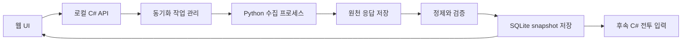

# P01 — 버튼 기반 계정 스펙 동기화 설계

작성: 2026-09-08. 상태: **P01-1~P01-6 구현·원천 대조 완료**. 실제 로그인·한국 서버 193명 수집·버튼 재동기화를 확인했다. [검증 보고서](p01-verification.ko.md)와 [구현 출처](p01-source-map.ko.md)를 따른다. 아래는 구현의 설계 기준이며 실게임 화면 재대조 범위와 전투 기능은 별도로 구분한다.

## 1. 목표와 범위

기본 경로는 UI의 **내 스펙 동기화** 버튼이다. 백엔드가 수집 → 원천 저장 → 정제 → 검증 → 새 snapshot 저장을 처리한다. 사용자가 CSV를 만들거나 Python 스크립트를 직접 실행할 필요가 없어야 한다.

최초 연결과 세션 만료 시에는 로그인이 필요하다. 그 외 정상 갱신에는 추가 확인 없이 선택한 계정의 스펙을 저장한다. CSV는 후순위이며 P01 완료의 필수 조건에서 제외한다. 로컬 JSON fixture는 개발·회귀 검증용으로 사용한다.

P01의 결과는 **추적 가능한 계정 입력 데이터**다. 실제 대미지 계산·정수화 판정은 P02 이후, 팀 전투 연결은 P03~P05, 대량 표본·추천은 P06 이후다. 기존 UI가 표시하는 upstream 계산 결과를 새 C# 검증 결과로 표시하지 않는다.

## 2. 사용자 흐름

### 최초 연결

1. UI의 `계정 연결`을 누른다.
2. 수집기 전용 브라우저에서 사용자가 블라블라링크에 로그인한다. 최초 구현은 직접 로그인으로 하며 비밀번호를 앱 DB에 보관하지 않는다.
3. 인증된 세션으로 조회 가능한 서버·계정을 확인한다. 복수일 때 사용자가 선택하며 캐릭터 수가 가장 많은 서버를 자동으로 확정하지 않는다.
4. 선택한 계정으로 첫 동기화를 진행한다. 계정이 하나라면 불필요한 선택 단계를 생략한다.

### 이후 갱신

`내 스펙 동기화` → 수집 중 `상세 80/150명` → 정제·검증 → 완료.

완료 화면은 동기화 시각, 수집 캐릭터 수, 변경 캐릭터·장비 수, 누락/미지원 항목을 보여준다. 사용자는 캐릭터를 열어 4부위·각 3줄·스킬·큐브·소장품을 확인할 수 있다. 내부 hash나 API 필드명은 일반 흐름에 노출하지 않는다.

동기화 중 중복 클릭은 기존 작업 상태로 연결한다. 페이지를 닫아도 백엔드가 살아 있으면 계속하며 다시 열면 상태를 복원한다. 취소·실패 시 기존 정상 스펙을 유지한다. 세션이 만료되면 `다시 로그인`을 보여주고, 연결 후 새 작업으로 전체 수집한다.

수동 보완은 수집 불가능한 값에 한정하지 않고 사용자 교정도 지원할 수 있게 계약을 둔다. P01 UI의 우선 대상은 OL 잠금 상태와 누락 계정 스탯이다. 수동 값은 출처를 표시하며 원천 응답을 수정하지 않는다.

## 3. 구성과 책임

| 구성 | 역할 | 도입 범위 |
|---|---|---|
| 기존 Vite/TypeScript UI | 연결·동기화·진행 상태·변경 내역·누락 확인 | `apps/web`에 필요한 UI 이식과 새 API adapter. 원본 참조 checkout은 유지 |
| .NET 10 / ASP.NET Core | 로컬 API, 계정 연결 메타데이터, 작업 수명 관리 | `src/Nikke.Api`, `Nikke.Contracts` |
| Python + Playwright/HTTP | 로그인 세션 확보, 계정/정적 데이터 수집 | `tools/data-pipeline`. 독립 subprocess로 실행하고 진행 이벤트 반환 |
| C# 정제·검증 | 원천 DTO → 공통 snapshot, 단위·ID·완전성 검사 | `src/Nikke.Data`. 계산 코어를 호출해 스펙을 역산하지 않음 |
| SQLite + 로컬 원천 파일 | 작업 이력, snapshot, current 포인터, 수동 보완 | `src/Nikke.Storage`, `data/local` |

초기에는 단일 로컬 API 프로세스의 백그라운드 작업으로 충분하다. CPU 전투 worker, Redis, 외부 클라우드 Worker를 P01 선행조건으로 추가하지 않는다. UI 진행 표시는 작업 API polling으로 시작한다. Python의 구조화된 진행/오류 이벤트와 일반 로그를 분리한다.

원천 파일은 쓰기 완료 후 hash와 manifest를 확정하고, SQLite에는 파일 참조를 저장한다. 조회 가능성 확보 전에 current 포인터를 바꾸지 않는다. 로컬 API는 loopback으로 제한하고 허용 origin·세션 검사를 둔다. 인증 쿠키는 브라우저 UI나 snapshot에 포함하지 않고 수집기 전용 로컬 저장소에서 접근을 제한해 관리한다.

## 4. 원본별 채택 내용

| 원본 | 재사용할 내용 | 바꿀 내용 |
|---|---|---|
| 기존 `getFromBlaLink.py` | 로그인 완료 관측, 로스터·요청 템플릿 확보, 상세 배치 수집, 부분 수집 오류 처리 | 자동 비밀번호 입력을 기본으로 삼지 않음. CLI/고정 경로 분리, 구조화된 진행·오류, ID 집합 완전성 검사 |
| upstream `profile_fetch.py` | 세션을 이용한 HTTP 호출, 전초기지 수집, 옵션·소장품 매핑 근거 | Python 계산용 프로필 출력 대신 원천 DTO 반환. OL 합산·기본값 대입을 제품 데이터 계약으로 계승하지 않음 |
| upstream `worker/src/index.js` | 엔드포인트 분리, 서버별 수집, 오류 분류 | 호출 구조 참고. 작성자 Worker나 쿠키를 사용하지 않고 로컬 수집기로 통합 |
| 기존 `blabla_merger.py` | C# 입력과 대응되는 필드, 계정 전역값·캐릭터 상세 결합 | 새 C# adapter로 재작성. OL 부위·줄·ID 보존, 소장품 ID/등급 보존, 누락 시 기본값 제거 |
| upstream `blablalink.ts` 및 UI | 부위별 OL 표시, 가져오기·갱신·오류 UX, 소장품 구분 | UI 전용 변환 결과를 저장 정본으로 삼지 않음. 정제는 백엔드에 통일, 가장 가까운 OL 단계로 강제 보정하지 않음 |
| 기존 roledata/정적 데이터 pipeline | 캐릭터 ID·옵션·소장품 등 매핑 데이터 | 계정 데이터와 다른 GameSnapshot으로 고정. 모든 crawler/LLM 의존성을 일괄 도입하지 않음 |
| `csv-import.ts` | 향후 보조 입력 경로 | P01 필수 구현에서 제외 |

우선 브라우저 세션 기반 수집을 연결하고, 동일 세션의 직접 HTTP 호출이 필요한 헤더와 계정 범위에서 동작하는지 확인해 반복 갱신 경로로 채택한다. 직접 HTTP 경로가 아직 검증되지 않아도 브라우저 context의 요청 기능으로 버튼 동기화를 완성할 수 있다. 브라우저 도입 여부가 사용자에게 매번 로그인을 요구하는 이유가 되어서는 안 된다.

## 5. 데이터 계약

| 계약 | 핵심 필드와 규칙 |
|---|---|
| AccountConnection | 연결 ID, 공급자 계정 식별자, 서버/area, 표시 이름, 세션 상태. 비밀 값 대신 세션 참조만 보관 |
| SyncJob | jobId, connectionId, 상태/단계, 예상·수집 개수, 시작/종료 시각, 오류 코드, 결과 snapshotId |
| RawManifest | 수집기 버전/commit, 시작·종료 시각, 계정·서버, 엔드포인트/배치 목록, 응답 hash, 수집 상태. 인증정보 제외 |
| GameSnapshot | 매핑/테이블의 source/hash/version/schema. 계정 수집 작업 시작 시 사용할 버전을 고정 |
| AccountSnapshot | schemaVersion, account/server, rawManifestId, gameSnapshotId, normalizerVersion, validationReport, contentHash |
| CharacterBuild | 원천 캐릭터 ID, 원천/유효 레벨, 돌파·코강·호감도·스킬, 큐브, 소장품 ID/등급/레벨·애장품 단계, 장비 목록 |
| EquipmentLine | 부위, 줄 번호, optionId/type, rawValue/rawUnit, normalizedValue/unit, valueTier, presence, lockState, 출처·관측시각 |
| ManualOverride | 대상 계정·캐릭터·필드, 보완 값, 근거 snapshot/장비 fingerprint, 수정 시각·revision |

동일 이름이나 다른 버전 캐릭터를 이름으로 합치지 않는다. 표시 이름은 별도 매핑으로 제공한다. 장비 4부위×3줄은 모두 표현하며, `없음`과 `미확인`을 분리한다. 옵션을 찾지 못했다고 빈 줄로 바꾸지 않는다.

OL 합계는 파생값이다. 원천 옵션 ID·개별 수치는 남기고, 부동소수점 오차로 옵션 단계를 억지로 맞추지 않는다. 원천 단위와 정규화 단위는 계약에 명시한다. 예를 들어 원천 1181이 11.81%를 뜻하는 필드라면 정규화 비율은 0.1181이다. 이 변환은 필드/스키마 근거를 검사한 뒤 적용한다.

실제 계정 레벨과 Solo Raid 시나리오에서 적용할 레벨은 별개다. 수집 단계에서 게임 모드의 고정 레벨로 원천값을 덮지 않는다. 현재 장착 큐브와 관측된 보유 큐브도 구분하며, 장착 관측만으로 전체 보유량/장착 가능 수를 확정하지 않는다.

수동 보완을 합친 결과도 새 immutable snapshot/revision으로 저장한다. 갱신 후 장비·옵션 fingerprint가 바뀌면 기존 잠금 보완을 자동 승계하지 않고 재확인 대상으로 표시한다. 동기화와 수동 수정이 겹치면 revision을 확인해 최신 수정이 조용히 유실되지 않게 한다.

TeamSpec/TacticSpec/ScenarioSpec/RunResult/EffectResult는 P01에서 snapshot 참조와 식별자 경계 초안만 정한다. 실제 전투 규격과 효과별 기록의 세부 구현은 P02~P05에서 검증하며 확장한다.

## 6. 검증·현재 스펙 전환 정책

수집 성공과 계산 가능 여부를 분리한다. 정상적으로 받은 계정에도 미지원 신캐나 비공개 콘솔이 있을 수 있다.

| 상황 | 저장 및 UI 동작 |
|---|---|
| 정상 응답, 필수 식별·완전성 검사 통과 | 새 snapshot 저장 후 current 전환. 캐릭터·장비 변경 요약 표시 |
| 정상 수집이나 콘솔/잠금 등 선택 정보 미확인 | unknown과 원인을 저장. current 전환 가능하되 관련 계산/육성 추천 가능 여부를 별도 표시 |
| 계정에는 있으나 엔진 미지원 캐릭터/효과 | 원천 ID와 수집값을 유지하고 unsupported 표시. 지원 여부만으로 계정 수집을 실패 처리하지 않음 |
| 성공 응답 안의 상세 누락·중복 충돌, 잘못된 계정/서버, 필수 필드 형식 오류, 해석 불가능한 필수 매핑 | 원천·오류 보고서 보존, current 전환 금지. 이전 정상 snapshot 유지 |
| 세션 만료 | 재연결 필요 표시. 혼합 시점의 부분 결과를 이어 붙이지 않고 재연결 뒤 새 작업 |
| 취소·타임아웃·프로세스 종료 | 작업 상태 기록, current 유지. 재시작 시 남은 running 작업을 interrupted로 정리 |

중복 상세는 원천에서 그대로 추적한다. 완전히 같은 중복은 정제 시 제거하고, 동일 ID의 서로 다른 상세는 충돌로 보고 재수집한다. roster ID 집합과 detail ID 집합을 비교하고, 배치 사이 계정 스펙이 바뀔 수 있음을 고려해 수집 시작·종료 시각과 로스터 재확인 결과를 남긴다. 외부 API가 시점 고정을 제공한다고 가정하지 않는다.

일시적인 네트워크·서버 오류만 제한 횟수로 재시도하고 서버의 대기 지시가 있으면 따른다. 인증·권한·스키마 오류는 자동 반복하지 않는다. 성공과 실패의 판정은 단순 HTTP 200이나 수집 개수에만 의존하지 않는다.

완성된 원천 파일/manifest를 준비한 뒤 DB transaction에서 snapshot·검증 결과·current 포인터를 함께 저장한다. 실패 중 생성된 원천 파일은 current에서 참조되지 않는다. 같은 내용이면 snapshot 본문을 중복 생성하지 않아도 되지만 수집 작업·관측 시각·원천 manifest 이력은 별도로 남긴다.

계정·서버별 활성 동기화는 하나로 제한한다. 버튼 재전송은 같은 작업을 돌려준다. 전투 실행은 시작 시 snapshotId/gameSnapshotId/manual revision을 고정하며, 새 동기화 결과가 진행 중 전투에 섞이지 않는다.

## 7. 로컬 API 초안

| 요청 | 목적 |
|---|---|
| `POST /api/connections` | 계정 연결 작업 시작, connectionId 반환 |
| `GET /api/connections/{id}` | 로그인/계정 선택 상태 및 서버 후보 조회 |
| `PATCH /api/connections/{id}` | 사용자가 선택한 계정·서버 확정 |
| `POST /api/connections/{id}/reauth` | 만료된 세션 재연결 시작 |
| `POST /api/sync-jobs` | connectionId 기준 동기화 시작, `202 + jobId`; 활성 작업이 있으면 그 작업 반환 |
| `GET /api/sync-jobs/{id}` | 진행 단계·수집 수·오류·결과 snapshot 조회 |
| `POST /api/sync-jobs/{id}/cancel` | 취소 요청; 저장 transaction 완료 후라면 완료 상태 유지 |
| `GET /api/accounts/{id}/snapshot` | 선택 서버에 해당하는 현재 snapshot/품질 상태 조회 |
| `GET /api/snapshots/{id}/changes` | 직전 snapshot 대비 변경 요약 |
| `POST /api/accounts/{id}/overrides` | 근거 revision을 포함한 수동 보완, 새 유효 snapshot 생성 |

Account ID 자체를 계정+서버 연결에 대응시켜 다른 서버가 같은 저장 위치를 공유하지 않게 한다. API와 Python subprocess 계약은 schemaVersion을 포함한다. P01 구현 중 이름을 바꿔도 상태·식별·저장 규칙은 유지한다.

## 8. 구현 순서와 완료 조건

| 순서 | 작업 | 확인 가능한 결과 |
|---|---|---|
| P01-1 | 계약·필드 출처표·익명 fixture | 원천 ID, 4×3줄, 단위, unknown, 수동 보완 기준을 확정. 정상·누락·중복·미지원 사례 준비 |
| P01-2 | 정제기·검증기 | fixture → AccountSnapshot → 재읽기에서 값·부위·줄 불변. 기존 C# 입력 필드와 대응 확인 |
| P01-3 | SQLite·작업 API·원천 저장 | 실패/취소/중복 요청/재시작에도 current 보존. 가짜 수집기로 전체 흐름 검증 |
| P01-4 | 로그인·실제 수집기 adapter | 사용자 계정 연결, 로스터/상세/전초기지 수집, 세션 갱신 경로와 구조화 오류 검증 |
| P01-5 | 웹 연결·동기화·스펙 확인 UI | 버튼 → 진행 표시 → 저장 결과, 재진입 상태 복원, 누락·변경 내역과 수동 보완 |
| P01-6 | 실제 입력 대조·P02 인계 | 수집·저장 후 4부위/옵션 줄/스킬/호감도/큐브/소장품 표본을 원천 및 가능한 실게임 화면과 대조. 첫 보스·최소 덱 후보와 미지원 목록 기록 |

개발 fixture가 선행하는 이유는 사용자가 파일을 주어야 한다는 뜻이 아니라, 실제 로그인 전에 데이터 손실·실패 처리부터 확인하기 위해서다. Python과 C# 단위 변환을 두 군데서 따로 수행하지 않는다.

P01 종료 시 반드시 확인할 항목:

- 정상 연결 상태에서 버튼 한 번으로 새 스펙을 저장하고 UI에서 확인한다.
- 첫 로그인/재로그인을 제외하고 CSV 제출·터미널 조작을 요구하지 않는다.
- 상세 누락이나 검증 실패를 성공으로 표시하지 않으며 정상 스펙을 덮지 않는다.
- OL 부위·줄·ID·정확한 수치가 round-trip 후에도 보존된다.
- 모르는 값과 미장착/0을 구분하고, 변경된 장비에 과거 잠금 보완을 잘못 적용하지 않는다.
- 서버/계정이 섞이지 않으며, 새 갱신과 독립적으로 이전 snapshot을 조회할 수 있다.
- 실제 실행한 수집 경로·검증 결과·가져온 기능의 출처와 수정 내역을 문서화한다.

계정 연결은 실제 P01 실행 때 사용자 로그인으로 확인한다. 아직 특정 시즌 보스, 계정별 잠금 필드 제공 여부, 직접 HTTP 경로의 현행 동작은 지원 확정하지 않는다. 이 불확실성은 공통 계약·정제·저장·UI 작업을 막지 않는다.
